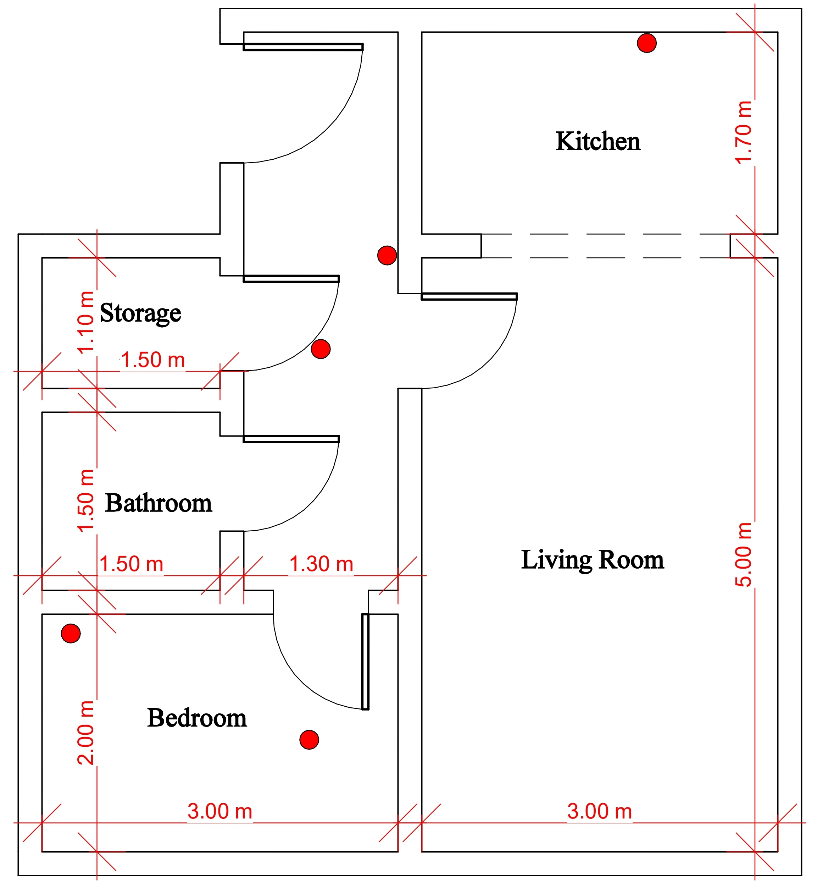

# SenseLess: Minimal Vision, Maximum Insight for Smart Homes 
SenseLess is a privacy-aware hybrid anomaly detection framework for smart indoor environments. It combines non-vision sensors with selective vision support to improve reliability while minimising visual exposure. The system automatically generates image labels without manual annotation by aligning sensor-detected events with camera data. These labels are further refined using self-supervised visual representations.

During deployment, SenseLess relies primarily on non-vision sensors. The vision model is activated only when predictions are uncertain or when sensor drift is detected. This design preserves privacy while maintaining robustness and long-term adaptability.

---

## Experimental Setup

### House Layout
The deployment was conducted in a one-bedroom apartment with the following rooms:
- **Bedroom** (3.00 m × 2.00 m) – lower left
- **Bathroom** (1.50 m × 1.30 m) – center-left  
- **Storage** (1.10 m) – left side
- **Kitchen** (1.70 m) – upper right
- **Living Room** (5.00 m × 3.00 m) – center/lower right

[See floor plan below with sensor positions: red circles for BME280, green squares for MH-Z16 CO₂, and blue triangles for ultrasonic sensors]



### Sensors & Specifications

The system employs readily available environmental sensors to avoid dependence on home-specific infrastructure. All sensor data is acquired synchronously at **1 Hz sampling rate** via an Arduino Leonardo, ensuring consistent temporal alignment across the entire apartment.

#### Non-Vision Sensors

| Sensor | Measurement | Placement | Sampling Rate | Notes |
|--------|-------------|-----------|----------------|-------|
| **Grove BME280** | Temperature, Humidity, Barometric Pressure | Kitchen, Bedroom | 1 Hz | Environmental monitoring for ambient conditions |
| **MH-Z16 CO₂ Sensor** | Carbon Dioxide concentration (ppm) | Kitchen, Bedroom | 1 Hz | Indoor air quality; sensitive to occupancy |
| **Grove Ultrasonic Distance Sensor** | Distance to objects in pathway | Bedroom door, Living Room entry, Corridor | 1 Hz | Detection of abnormal objects obstructing pathways |

#### Vision Sensors

| Sensor | Type | Connection |
|--------|------|-----------|
| **Raspberry Pi Camera Module 2** | RGB Camera | Raspberry Pi |
| **MLX90640 Thermal Camera** | Thermal Imaging (32×24 pixels) | Raspberry Pi |

#### Data Acquisition Hardware

- **Microcontroller**: Arduino Leonardo (USB/Serial)
- **Edge Device**: Raspberry Pi (Camera + thermal processing)
- **Communication**: Serial/USB connection between Arduino and processing system

#### Sensor Placement & Coverage
All sensors are strategically positioned to monitor key areas:
- **Kitchen**: BME280 (environmental), MH-Z16 (CO₂ – appliance/cooking detection)
- **Bedroom**: BME280 (environmental), MH-Z16 (CO₂ - occupancy detection)
- **Corridor**: Ultrasonic (abnormal objects obstructing pathways)

### Datasets

Four use-case-specific sensor datasets were collected from the apartment. Each dataset is organized per anomaly type and contains synchronized sensor readings at 1 Hz sampling rate:

| Dataset | Description | Key Sensors | Columns | Records | File Size |
|---------|-------------|-------------|---------|---------|-----------|
| **Open Door** | Door opening events and environmental changes | BME280 (temperature, humidity, pressure) | Temperature, Humidity, Pressure, Stat, Status, Date, Time, Timestamp | 1,350,000 | 97.45 MB |
| **Appliance** | Appliance usage and environmental effects | BME280, MH-Z16 (CO₂) | Temperature, Humidity, CO₂, Stat, Status, Date, Time, Timestamp | 1,350,000 | 87.31 MB |
| **Occupancy** | Occupancy patterns and air quality | MH-Z16 (CO₂) | CO₂, People_count, Status, Date, Time, Timestamp | 1,328,527 | 68.55 MB |
| **Abnormal Objects** | Objects obstructing pathways | Ultrasonic distance sensors (2x) | S1_position, S1_distance, S2_position, S2_distance, Time, Date, Timestamp, Status | 1,350,030 | 83.72 MB |

---

## Installation & Dependencies

### Requirements
Install all required Python packages using the provided requirements file:

```bash
pip install -r requirements.txt
```

The `requirements.txt` includes all core dependencies:
- **Data Science & ML**: numpy, pandas, scikit-learn, scipy
- **Deep Learning**: PyTorch, torchvision
- **Image Processing**: Pillow, OpenCV
- **Visualization**: matplotlib
- **Model Persistence**: joblib
- **Hardware Communication**: pyserial (for Arduino)
- **Utilities**: tqdm (progress bars)

**Note**: Custom modules like `timmML2`, `timmML_025`, and `timmML_half` (used for specific CO₂ crowd counting models) are located in `training/models/co2/effcc_distilled_main/` and may require separate setup if you're working with the CO₂ use case.

### Python Version
Recommended: Python 3.8 or higher

---

## Training pipeline (run first)
1. **Configure training**  
   - Edit `training/config/config_manager.py` for data paths, model/save dirs, and use-case settings.
2. **Prepare data**  
   - Sensor CSVs and image folders should be organized per use case.  
   - Optional: place existing models under `training/models/` to warm-start.
3. **Run main training**  
   ```bash
   python training/main_training.py --use_case door
   ```
   Key stages inside `main_training.py`:
    - **Non-vision model training** (`training/non_vision_subsystem/train_adaptive_autoencoder.py`).
    - **Delay-aware alignment (HEDS)** (`training/non_vision_subsystem/dynamic_delay_calibration.py`, `delay_calculation.py`) to compensate heterogeneous sensor/image delays.
   - **Sensor-guided anomaly detection** (`training/non_vision_subsystem/detect_anomalies.py`) → pseudo event labels (non-vision).
   - **Self-supervised visual clustering** (`training/ssl_subsystem/ssl_train_cluster.py`) → visual clusters.
   - **Confidence-weighted label refinement** (`training/label_refinement_subsystem/refine_labels.py`) → high-quality image pseudo-labels.
   - **Vision classifier training** (`training/camera_anomaly_detection/train_image_classifier.py`).

4. **Artifacts produced**
   - Vision and non-vision models under `deployment/models/<use_case>/` (or copy from `training/models/`).
   - Refined pseudo-labels / logs under `training/data/` and `training/figures/` (as configured).

### Training-related entry points and modules
- `training/non_vision_subsystem/train_adaptive_autoencoder.py`: Non-vision anomaly model training.
- `training/non_vision_subsystem/dynamic_delay_calibration.py`: HEDS-based delay compensation.
- `training/non_vision_subsystem/detect_anomalies.py`: Non-vision inference utilities (training/eval).
- `training/ssl_subsystem/ssl_train_cluster.py`: Self-supervised visual clustering.
- `training/label_refinement_subsystem/refine_labels.py`: Confidence-weighted label refinement.
- `training/camera_anomaly_detection/train_image_classifier.py`: Vision model training.
- `training/main_training.py`: Orchestrates the full training workflow.
- `training/migration_utility.py`: Utilities for migrating/aligning artifacts.

---

## Deployment pipeline (after training artifacts are ready)
### Quickstart
1. Ensure trained artifacts are placed under `deployment/models/<use_case>/` and paths are correct in `deployment/config/config_deployment.py`.
2. From repo root, run:
   ```bash
   python deployment/main_deployment.py --use_case door
   ```
3. Outputs:
   - Decisions/logs: `logs/door/decisions.csv`
   - Alerts: `alerts/`
   - Drift history (if enabled): `logs/door/drift_history.csv`

### Pipeline stages (toggle in `deployment/main_deployment.py`)
1. **Sensor inference** (non-vision): `deployment/sensor_inference.py` → predictions/logits.
2. **Confidence estimation**: `deployment/uncertainty/confidence_estimation.py` → calibrated scores, low-confidence flags.
3. **Vision fallback**: `deployment/uncertainty/fallback_manager.py` → vision only for low-confidence or sensor-error cases.
4. **Drift detection** (optional): `deployment/drift_detection/drift_detector.py`; baseline upkeep via `deployment/drift_detection/baseline_manager.py`.
5. **Auto-retraining** (optional): `deployment/retraining/retraining_manager.py` when drift is flagged.

Adjust toggles in `main_deployment.py` (e.g., `config.enable_drift_detection`, `config.enable_auto_retraining`, `config.enable_vision_fallback`).

### Deployment configuration notes
- Use-case paths (sensor CSV, image folder, models) are set in `deployment/config/config_deployment.py` (`use_case_config`).
---

## Repository layout (selected)
- Training: `training/` (see modules above).
- Deployment: `deployment/main_deployment.py`, `deployment/config/config_deployment.py`, `deployment/sensor_inference.py`, `deployment/uncertainty/`, `deployment/drift_detection/`, `deployment/retraining/`.
- Models: `deployment/models/<use_case>/`
- Logs/alerts: `logs/<use_case>/`, `alerts/`

---

## Typical end-to-end workflow
1. Configure and run training (`training/main_training.py`) to produce sensor + vision models.
2. Place/copy trained artifacts into `deployment/models/<use_case>/`.
3. Configure deployment paths/toggles in `deployment/config/config_deployment.py`.
4. Use the deployment pipeline for offline simulation/validation.
5. For live hardware streaming, use the real-time module (`live_inference/`).
6. Monitor outputs: offline under `logs/<use_case>/decisions.csv`; live under `live_inference/logs/<use_case>/` and `live_inference/alerts/<use_case>/`.

---

## Real-Time Live Inference (hardware streaming)
SenseLess also includes a real-time streaming pipeline that connects to an Arduino (Bluetooth/serial) for on-device sensor readings and activates the camera only when needed. This is the runtime module intended for field deployment.

### What it does
- Reads sensor values live from an Arduino on a given COM/serial port.
- Runs the trained non-vision model (adaptive autoencoder) per sample.
- Applies mandatory isotonic calibration to confidence (requires `sensor_isotonic.pkl`).
- Triggers the vision fallback selectively when confidence is low or a sensor error occurs.
- Logs streaming data for later retraining.

### Differences vs the Deployment module
- Real-time (`live_inference/`) is hardware‑connected and streaming; it drives end‑to‑end decisions on live inputs and captures images on demand.
- Deployment (`deployment/`) is a simulation/testing pipeline operating on recorded CSVs and images; it’s ideal for functional validation, offline experiments, and integration checks without hardware.
- Real-time writes outputs under `live_inference/` (e.g., logs, optional fallback images); the simulation writes under `logs/` and `alerts/`.

### Requirements
- Trained artifacts placed under `deployment/models/<use_case>/`:
   - Non‑vision model folder (e.g., `adaptive_<use_case>.pkl` and scaler inside that directory)
   - Vision classifier (e.g., `door_mobilenetv2.pth`)
   - Isotonic calibration: `sensor_isotonic.pkl` (mandatory for adaptive confidence)
- Arduino connected over serial/Bluetooth (e.g., `COM7` on Windows).
- Optional webcam/camera for vision fallback.

### Quickstart (Windows example)
From the repo root:

```powershell
python -m live_inference.main_live_inference --use_case door --arduino_port COM7 --log_level WARNING
```

Useful flags:
- `--compact`: print minimal per-sample output
- `--preview`: show brief camera preview when capturing
- `--preview_ms 1500`: preview window display duration in ms
- `--save_images`: persist captured fallback images (default per use case)

Example:

```powershell
python -m live_inference.main_live_inference --use_case door --arduino_port COM7 --log_level WARNING --compact --preview --preview_ms 1500 --save_images
```

### Outputs
- Sensor stream log: `live_inference/logs/<use_case>/incoming_sensor_data.csv`
- Alerts: `live_inference/alerts/<use_case>/`
- Fallback images (if enabled): `live_inference/fallback_images/<use_case>/`

### Notes & troubleshooting
- If you see `Isotonic calibration model missing (required)`, place `sensor_isotonic.pkl` under `deployment/models/<use_case>/`.
- COM port may differ (e.g., `COM3`, `COM7`). Verify your Arduino port.
- The camera index defaults to 0 and falls back to 1 if needed; use `--preview` to verify capture.
- Physical bounds for sensors are defined per use case in `deployment/config/use_case_configs.py` (e.g., door pressure range).

